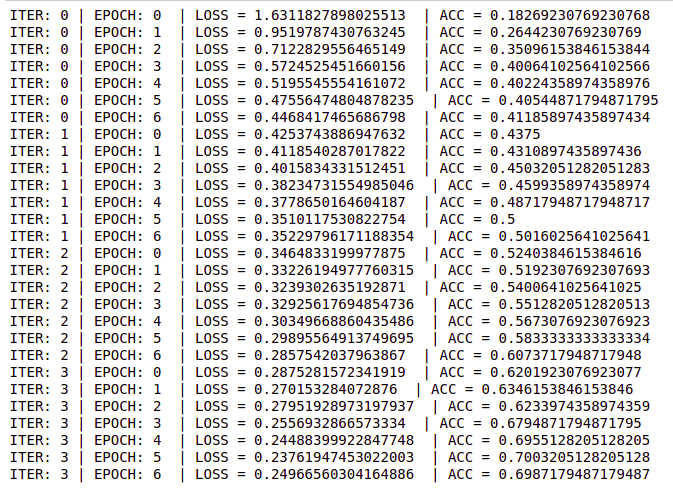

```python
# piptorchvisionll albumentations==0.4.6
from torch.nn import Module, AvgPool2d, MaxPool2d, BatchNorm2d, Conv2d, Linear as L, ReLU as R, Sigmoid as S, Sequential, NLLLoss as nll_loss
from torch.utils.data import DataLoader, Dataset
from torchvision.utils import make_grid
from torch.autograd import Variable
import matplotlib.pyplot as plt
from torch.functional import F
import albumentations as A
import pandas as pd
import numpy as np
import torch
import cv2
import os
```

### Datatset


```python
class PneumoniaDataset(Dataset):
    
    def __init__(self, path="chest_xray_20210414/",sub_path='train', img_size=256,device='CPU', is_train=False):
        self.path = path
        self.img_size = img_size
        self.sub_path = sub_path
        self.device = device
        self.is_train = is_train
        #-------------------------------------------------------------#
        self.samples = self.sampler()
        self.transforms = self.transformer()
        
    def sampler(self):
        """CHARGEMENT DYNAMIQUE DE TOUTES LES IMAGES: NORMALE | PNEUMONIA"""
        new_path = os.path.join(self.path, self.sub_path)
        return [ (os.path.join(new_path,etat,i), etat) for etat in os.listdir(new_path) for i in os.listdir(new_path+"/"+etat)]
        return [(self.transforms(i),j) for i,j in images]
    
    def transformer(self):
        """TRANSFORMATION DE NOTRE IMAGE AFIN DE REDUIRE LE BIAIS"""
        if self.is_train:
            transform = A.Compose([
                A.CLAHE(),
                A.RandomRotate90(),
                A.DualTransform(), # adding
                A.Transpose(),
                A.Resize(height=self.img_size, width=self.img_size, interpolation=cv2.INTER_AREA), # RESIZE
                A.ShiftScaleRotate(shift_limit=0.0625, scale_limit=0.50, rotate_limit=45, p=.75),
                A.Blur(blur_limit=3),
                A.OpticalDistortion(),
                A.GridDistortion(),
                A.HueSaturationValue(),
            ])
        else:
            transform = A.Compose([
                A.Resize(height=self.img_size, width=self.img_size, interpolation=cv2.INTER_AREA), # RESIZE
            ])
            
        return transform
    
    def __len__(self):
        return len(self.sampler())
        
    def __getitem__(self, index):
        
        # GET ONE IMAGE
        try:
            path_to_img, class_type =  self.samples[index]
        except Exception as ie:
            print("Index n'existe pas; Taille maximale = {}".format(self.__len__()))
            path_to_img, class_type =  self.samples[-1]
            
        
        # TANSFORM LABEL
        class_type = 0 if class_type == "NORMAL" else 1
        
        # LOAD IMAGE
        img = cv2.imread(path_to_img)
        img = cv2.cvtColor(img, cv2.COLOR_BGR2RGB)
        
        # RESIZE IMAGE
        img_resize = cv2.resize(img, (self.img_size, self.img_size), interpolation=cv2.INTER_AREA)        
        
        # AUGMENT IMAGE
        import random
        random.seed(42) 
        augmented_image = self.transforms(image=img_resize)['image']
        ## CONVERT ARRAY NUMPY TO TENSOR
        img_tensor = torch.from_numpy(augmented_image).float()
        img_tensor = img_tensor.permute(2,0,1)                
        
        return img_tensor, class_type
    
    
        
```


```python
train_dataset = PneumoniaDataset(sub_path='train')
test_dataset = PneumoniaDataset(sub_path='test', is_train=True)
val_dataset = PneumoniaDataset(sub_path='val')
```


```python
len(test_dataset)
```

### Dataloader


```python
def dataload(data, bSize=3, sFle=True, nWkr=1):
    dataloader = DataLoader(
                    data,
                    batch_size=bSize,
                    shuffle=sFle,
                    num_workers=nWkr
                )
    return dataloader
```


```python
train_dataload = dataload(train_dataset)
test_dataload = dataload(test_dataset, sFle=True)
val_dataload = dataload(val_dataset, bSize=2, sFle=False)
```


```python
class PneumoniaFakeModel(Module):
    def __init__(self):
        super(PneumoniaFakeModel, self).__init__()
        
        # Image size [3, 3, 256, 256]

        
        self.conv1 = Conv2d(in_channels=3, out_channels=12, kernel_size=3, stride=1, padding=1)
        self.fc2 = L(256, 50)
        self.fc3 = L(50, 2)
        
        self.pool1 = MaxPool2d(kernel_size=2) # Reduce the image size be factor 2
        self.relu2 = R()
        self.sig = S()
        self.bn1 = BatchNorm2d(num_features=12)
        self.pool2 = MaxPool2d(kernel_size=2) # Reduce the image size be factor 2
    
    
    def forward(self, x):
        x = self.conv1(x)
        x = self.fc2(x)
        x = self.bn1(x)
        x = self.relu2(x)
        
        x = self.sig(x)
        
        x = self.fc3(x)
        x = self.pool1(x)
        
        bSz, _, _, _ = x.shape
        x = x.view(bSz, -1)
        
        
        return F.log_softmax(x, dim=1)
```

### Modele

- Choix du device


```python
myDevice = 'cuda' if torch.cuda.is_available() else 'cpu'
print('Using {} device'.format(myDevice))
```


```python
modelFk = PneumoniaFakeModel()
modelFk.to(myDevice)
```

- Pseudo test du modèle


```python
# [N, C, W, H]
X = torch.randn([2, 3, 256,256])
```


```python
m = modelFk(X)
m
```

### Train


```python
from torch.optim import Adam, RMSprop
from torch.nn import KLDivLoss, CrossEntropyLoss
```


```python
modelFake = PneumoniaFakeModel()
modelFake.to(myDevice)
```

- Optimizer et Fonction d'erreur


```python
optimizer = Adam(modelFake.parameters(),lr=0.001, weight_decay=0.0001)
loss_function = CrossEntropyLoss(size_average=0.5)
```

- Entrainement du modèle


```python
# Fonction d'entrainement du modele
def entrainement(iteration, epochs, dataloader, model):
    for i in range(iteration):
        for epoch in range(epochs):
            model.train() # on lance le modele en mode entrainement

            train_accuracy=0.0 # initialisation
            train_loss=0.0 # initialisation

            for j, (inputs, labels) in enumerate(dataloader):
                images = inputs.to(myDevice)
                labels = labels.to(myDevice)

                optimizer.zero_grad()

                outputs = model(images)
                loss = loss_function(outputs,labels)

                loss.backward()
                optimizer.step()

                train_loss += loss
                _, prediction = torch.max(outputs.data, dim=1)

                train_accuracy += int(torch.sum(prediction==labels.data))

            train_accuracy=train_accuracy/624
            train_loss=train_loss/624

            print("ITER: {} | EPOCH: {}  | LOSS = {}  | ACC = {}".format(i, epoch, train_loss, train_accuracy))
#END
```

NB: Pour l'entrainement du modele, je prendrai le dataloader du Test pour des raisons de ressources(memoire)


```python
epochs = 7
entrainement(iteration=4, epochs=epochs, dataloader=test_dataload, model=modelFake)
```




```python

```

### Test


```python

```


```python

```

### Evaluate


```python

```


```python

```
